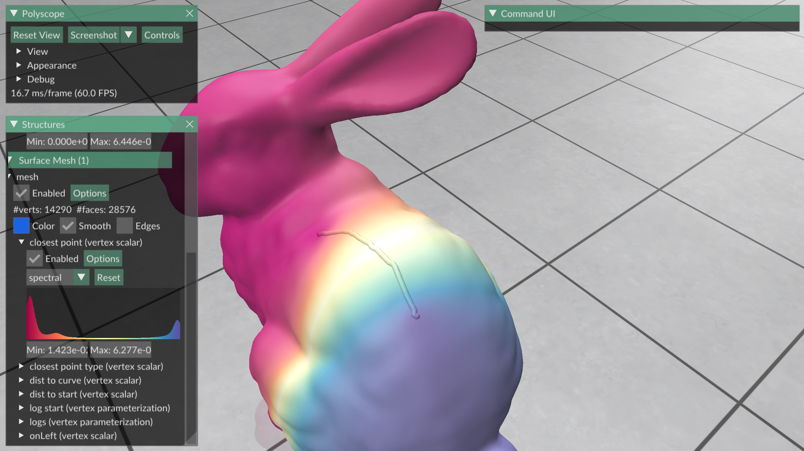
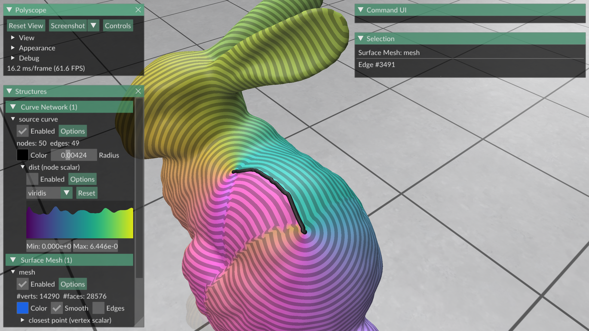

# CurveLogMap

Hacked-together experiment to compute a "log map along a curve".

Given a curve along a mesh, computes the closest point function (i.e. for each point on the mesh, finds which point along the curve is closest)

as well as the log (i.e. from that closest point on the curve, which direction and how far do you have to walk to reach the original point)


These computations are performed approximately using the heat/vector heat method.

```
cd build
make -j7
```

Then run the code with
```
bin/run /path/to/a/mesh
```
